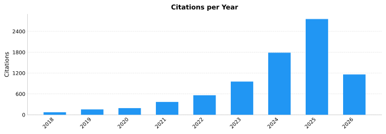

### Hi there 👋

Software Engineer with a PhD in [Computer Science and Automation Engineering](http://phd.dia.uniroma3.it/), currently Research Associate at the [Blankenberg Lab](https://www.lerner.ccf.org/computational-medicine/blankenberg/), [Computational Life Sciences](https://my.clevelandclinic.org/research/computational-life-sciences), [Cleveland Clinic Research](https://www.lerner.ccf.org/), [Cleveland Clinic Foundation](https://my.clevelandclinic.org/), Cleveland, Ohio, USA.

[Personal Web Space](https://cumbof.github.io/) | [Github](https://github.com/cumbof) | [X](https://x.com/cumbofabio) | [Google Scholar](https://scholar.google.com/citations?user=DJWJY7EAAAAJ&hl=en) | [ORCID](https://orcid.org/0000-0003-2920-5838)

<!-- SCHOLAR-START -->

---

**Research interests:** [Bioinformatics](https://scholar.google.com/citations?view_op=search_authors&hl=en&mauthors=label:bioinformatics) · [Metagenomics](https://scholar.google.com/citations?view_op=search_authors&hl=en&mauthors=label:metagenomics) · [Vector Symbolic Architectures](https://scholar.google.com/citations?view_op=search_authors&hl=en&mauthors=label:vector_symbolic_architectures) · [Hyperdimensional Computing](https://scholar.google.com/citations?view_op=search_authors&hl=en&mauthors=label:hyperdimensional_computing)

  

_Updated on 2026-05-21 · [Google Scholar](https://scholar.google.com/citations?user=DJWJY7EAAAAJ&hl=en)_

#### Recent Publications

- **2026** · [Designing vector-symbolic architectures for biomedical applications: ten tips and common pitfalls](https://scholar.google.com/citations?view_op=view_citation&hl=en&user=DJWJY7EAAAAJ&citation_for_view=DJWJY7EAAAAJ:dshw04ExmUIC) — *PeerJ Computer Science*
- **2026** · [Quantum hyperdimensional computing: a foundational paradigm for quantum neuromorphic architectures](https://scholar.google.com/citations?view_op=view_citation&hl=en&user=DJWJY7EAAAAJ&citation_for_view=DJWJY7EAAAAJ:CHSYGLWDkRkC) — *npj Unconventional Computing*
- **2026** · [hdlib 2.0: Extending Machine Learning Capabilities of Vector-Symbolic Architectures](https://scholar.google.com/citations?view_op=view_citation&hl=en&user=DJWJY7EAAAAJ&citation_for_view=DJWJY7EAAAAJ:nb7KW1ujOQ8C) — *arXiv preprint arXiv:2601.02509*
- **2026** · [An Automatic Pipeline for the Integration of Python-Based Tools into the Galaxy Platform: Application to the anvi'o Framework](https://scholar.google.com/citations?view_op=view_citation&hl=en&user=DJWJY7EAAAAJ&citation_for_view=DJWJY7EAAAAJ:P5F9QuxV20EC) — *arXiv preprint arXiv:2601.02283*
- **2026** · [Structural Basis of M1 Muscarinic and H3 Histamine Receptor Inhibition in OPC Differentiation](https://scholar.google.com/citations?view_op=view_citation&hl=en&user=DJWJY7EAAAAJ&citation_for_view=DJWJY7EAAAAJ:UxriW0iASnsC) — *bioRxiv*

<!-- SCHOLAR-END -->
